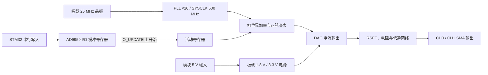

# STM32H743 外差测量与双通道 FFT 系统

## 项目简介

本工程面向大学生电子设计竞赛测量组，目标 MCU 为 STM32H743VIT6，开发环境为
STM32CubeIDE 1.19.0、STM32Cube FW_H7 V1.12.1。当前工程组合了以下功能：

- TIM5 对外部整形方波进行 1～30 MHz 粗测频；
- AD9834 产生低侧本振，目标中频为 100 kHz；
- ADC1/ADC2 以 600 kSPS 双重规则同步采样；
- 每通道执行 65536 点 F32 FFT，计算频率、电压、峰峰值、RMS、THD、波形和相位差；
- DAC1_OUT1 提供六档 VGA 控制电压，并根据实测电压计算 VG 和理论增益；
- USART1 驱动淘晶驰串口屏，显示测量结果并接收 VGA 档位和立即测量命令。

用户代码统一位于 `Core/User/`，`main.c` 的用户初始化区只调用 `system_init()`，
主循环只调用 `system_process()`。

## 硬件连接

| MCU 引脚 | 外设功能 | 连接与用途 |
|---|---|---|
| PA0 | TIM5_CH1 | 接过零比较器输出的 0～3.3 V 方波，用于输入频率粗测 |
| PA4 | DAC1_OUT1 | VCA821 六档控制电压输出，接模块外接 DA 控制输入 |
| PC4 | ADC1_INP4 | 双 ADC 同步采集 CH1 模拟输入 |
| PB1 | ADC2_INP5 | 双 ADC 同步采集 CH2 模拟输入 |
| PB12 | GPIO_Output | AD9834 FSYNC，空闲为高电平 |
| PB13 | SPI2_SCK | AD9834 SCLK |
| PB15 | SPI2_MOSI | AD9834 SDATA |
| PB14 | GPIO_Output | AD9834 FSELECT，低电平选择 FREQ0 |
| PD8 | GPIO_Output | AD9834 PSELECT，低电平选择 PHASE0 |
| PE2 | SPI4_SCK | AD9959 SCLK |
| PE5 | SPI4_MISO | AD9959 SDIO_2，读回数据 |
| PE6 | SPI4_MOSI | AD9959 SDIO_0，写入数据 |
| PD4 | GPIO_Output | AD9959 IO_UPDATE，上升沿刷新寄存器 |
| PD5 | GPIO_Output | AD9959 CS，空闲为高电平 |
| PB4 | GPIO_Output | AD9959 RESET，正常运行时为低电平 |
| PA9 | USART1_TX | 接淘晶驰串口屏 RX |
| PA10 | USART1_RX | 接淘晶驰串口屏 TX |

关键映射可简写为 `PA4 / DAC1_OUT1`、`PC4 / ADC1_INP4` 和
`PB1 / ADC2_INP5`。MCU、比较器、AD9834、模拟前端、VGA 和串口屏必须共地。
PC4 与 PB1 的模拟电压必须保持在 VSSA～VDDA 允许范围内。

AD9959模块使用独立5V单路供电并与STM32共地；除上表SPI与控制信号外，
模块 `PDC`、`SD3/SDIO_3` 以及 `P0～P3` 均接GND。尤其SDIO_3在单位串行模式下兼作
SYNC_I/O，数据手册明确要求未使用时保持逻辑0，禁止浮空。

## STM32CubeMX 配置

打开 `h743_pre1.ioc` 后，在 STM32CubeIDE 1.19.0 中核对以下配置。重新生成代码前，
在 `Project Manager > Code Generator` 勾选 `Keep User Code when re-generating`，然后按
`Alt+K` 或点击 `GENERATE CODE`。不要手工改写 CubeMX 生成的 `MX_*_Init()`。

### ADC1、ADC2、TIM2 与 DMA

- ADC1：PC4 / ADC1_INP4，16 bit，Rank 1，Single-ended，采样时间 8.5 Cycles。
- ADC2：PB1 / ADC2_INP5，16 bit，Rank 1，Single-ended，采样时间 8.5 Cycles。
- ADC1 为主 ADC，模式为 Dual regular simultaneous。
- ADC 时钟为异步时钟二分频；过载数据选择覆盖。
- ADC1 外部触发源为 TIM2 TRGO，上升沿触发。
- TIM2：Prescaler=0，Period=399，TRGO=Update，在 240 MHz 定时器时钟下产生
  600 kHz 采样触发。
- DMA1 Stream0：ADC1 request，Peripheral-to-memory，外设不递增、内存递增，
  Word/Word，Circular，Very High，FIFO Disabled。
- 32 位双 ADC 公共数据低 16 位为 ADC1/CH1，高 16 位为 ADC2/CH2。
- DMA 半满、满和 ADC 错误回调只设置各自标志，拆包和 FFT 输入均在主循环完成。

### TIM5 与 TIM3

- PA0 配置为 TIM5_CH1。
- TIM5 使用 External Clock Mode 1、TI1FP1、上升沿、无滤波、Prescaler=0、
  Period=0xFFFFFFFF。
- TIM3 使用 Prescaler=23999、Period=9999，约每秒产生一次更新中断，NVIC
  抢占优先级为 6。
- TIM3 回调只设置 `frequency_measure_flag`；主循环利用 TIM5 计数差和 DWT 周期差
  计算平均频率。

### SPI2 与 AD9834

- SPI2：Master、Transmit Only、Motorola、16 bit、MSB First。
- CPOL High，CPHA 1 Edge，软件 NSS，NSS Pulse Disabled。
- SPI123 内核时钟为 64 MHz，Prescaler=8，SCLK=8 MHz。
- AD9834 MCLK 为 75 MHz，FSYNC 由 PB12 手动控制。
- 不使用 SPI DMA 和 SPI 中断。

### SPI4 与 AD9959

- SPI4：Master、Full-Duplex、Motorola、8 bit、MSB First。
- CPOL Low，CPHA 1 Edge（SPI Mode 0），软件 NSS；CS 由 PD5 手动控制。
- SPI45 内核时钟为 120 MHz，保留 Prescaler=64、SCLK=1.875 MHz 的硬件SPI回退配置。
- SPI4 启用 `MasterKeepIOState`；硬件SPI回退路径把“指令字节+全部数据字节”拼成一次
  `HAL_SPI_Transmit`/`HAL_SPI_TransmitReceive`，CS低期间不再拆成相邻的H7 SPI事务。
- 当前 `AD9959_USE_GPIO_BITBANG=1`：`ad9959_init()` 暂时关闭SPI4并把PE2/PE6配置为推挽输出、PE5配置为下拉输入，按商家例程相同的Mode 0、MSB优先顺序模拟串行时序。该版本只用于隔离H7硬件SPI/HAL传输层，不改变寄存器值、复位、IO_UPDATE或外部接线。
- 两路FR1/CFR/CFTW0/ACR实板回读已经全部一致，当前
  `AD9959_BUS_PROBE_ENABLE=0`：初始化完成后总线保持静止，避免周期性诊断帧干扰模拟输出判断。
  如需重新观察总线，可临时开启探针；固件签名为 `0x52444531`（ASCII `RDE1`）。
- AD9959 板载 25 MHz 晶振经片内 PLL 20 倍频得到 500 MHz 系统时钟。
- PE6/SDIO_0 用于写入，PE5/SDIO_2 用于读回；PD4 产生 IO_UPDATE
- 驱动每次写 CSR 都设置 `CSR[2:1]=01` 三线模式（CH0=`0x12`、CH1=`0x22`），使 SDIO_0 作为输入、SDIO_2 作为读回输出。
  上升沿刷新影子寄存器，PB4 控制硬件 RESET。
- 不使用 SPI DMA 和 SPI 中断；每次写寄存器后自动产生一个 IO_UPDATE 脉冲。AD9959复位后PLL尚未启用，
  `SYNC_CLK=25MHz/4=6.25MHz`、周期约160ns；诊断固件把IO_UPDATE高电平固定保持40ms，
  保证首次FR1更新以及后续更新均满足“脉宽大于一个SYNC_CLK周期”的数据手册要求。

## AD9959 迁移、排错与当前交接状态

> **交接结论（2026-07-26）**
>
> AD9959 的数字配置链路已经在实板上闭环：PLL 已工作在 500 MHz，CH0/CH1 的
> FR1、CFR、CFTW0、ACR 全部可以正确回读，`readback_mismatch_mask=0x00`。
> 但模拟输出尚未闭环：两路 SMA 当前仍只看到约 2 mVpp、25/50 MHz 的参考时钟相关杂波，
> 没有看到目标 1 MHz、数百 mVpp 正弦波。因此当前状态不是“驱动已全部成功”，而是
> **数字寄存器链路已验证，IO_UPDATE 到模块焊盘的物理到达和 DAC 模拟电流通路仍待实板确认**。

### 正常信号通路



这条链路必须逐段成立：

1. 5 V 输入和板载稳压正常，AD9959 数字核、PLL 和 DAC 才能工作。
2. 25 MHz 参考时钟经 PLL 20 倍频得到 500 MHz；模块 `SYNC_CLK` 为 SYSCLK/4，
   因而正常读到约 125 MHz。
3. SPI/模拟串行接口把数据写进 I/O 缓冲寄存器；寄存器回读只证明这一段。
4. IO_UPDATE 上升沿把缓冲值装入活动寄存器；没有有效上升沿时，即使回读正确，DDS 也可能仍使用旧值。
5. 活动寄存器、DAC 电源、RSET 和输出滤波网络共同决定 SMA 上的模拟波形。

因此，**寄存器回读正确不等于模拟输出正确**；同样，125 MHz SYNC_CLK 只证明参考时钟、
PLL 和数字核心工作，不证明 DAC 电流或输出网络正常。

### 当前寄存器证据

| 项目 | 实板回读 | 含义 |
|---|---:|---|
| CSR CH0 / CH1 | `0x12` / `0x22` | 选择对应通道，并启用三线模式：SDIO_0 写、SDIO_2 读 |
| FR1 | `D0 00 00` | 25 MHz 参考时钟、PLL ×20，SYSCLK=500 MHz |
| CFR CH0 / CH1 | `00 03 02` | 单音正弦配置，通道未处于 DAC power-down |
| CFTW0 CH0 / CH1 | `00 83 12 6F` | `0x0083126F=8589935`，在 500 MHz SYSCLK 下对应约 1 MHz |
| ACR CH0 / CH1 | `00 13 FF` | 幅度缩放启用，10 位幅度值为 1023（满量程） |
| 综合结果 | `readback_mismatch_mask=0x00` | 上述期望值与两通道实测回读全部一致 |

`FTW = round(fout × 2^32 / SYSCLK)`，所以 1 MHz、500 MHz 时：

```text
FTW = round(1,000,000 × 2^32 / 500,000,000)
    = 8,589,935
    = 0x0083126F
```

### 排错过程与每一步为什么做

| 阶段现象 | 当时检查的内容 | 为什么检查 | 结论或修复 |
|---|---|---|---|
| 两路完全 0 V | 5 V、共地、PDC、RESET、CS | 先排除整片掉电、复位或 power-down | 修正供电方式；外部 5 V 与 STM32 共地，禁止和 ST-Link 5 V 并联 |
| 约 3 mV、50 MHz 畸变 | 25 MHz 晶振、PLL、输出端 | 极小幅度且与参考时钟谐波相关，通常是串扰而非 DDS 输出 | 将其定义为“参考时钟泄漏”，不再误判为目标信号 |
| 回读全 `FF` | CSR 串行模式 | 默认二线模式下 SDIO_2 不输出，MISO 浮空会读成 `FF` | CSR 改为 CH0=`0x12`、CH1=`0x22`，启用三线读回 |
| 回读全 `00` | CS、SCLK、SDIO_0、SDIO_2 与下拉 | 判断 MCU 是否真的发帧，以及模块是否驱动读回线 | 增加总线探针、GPIO ODR/IDR 和读回快照 |
| CS 看不到脉冲 | 周期探针宏、暂停/运行状态、单次触发 | 初始化帧很短，晚开示波器会错过 | 临时启用周期探针验证 CS；确认后现已关闭，避免干扰输出 |
| PLL 始终像未启用 | IO_UPDATE 高电平宽度 | 上电默认 SYSCLK=25 MHz，首次更新至少要跨过一个 160 ns SYNC_CLK 周期 | 把诊断版 IO_UPDATE 高电平扩展为 40 ms，完全消除脉宽裕量疑问 |
| H7 硬件 SPI 不稳定 | 数据宽度、相邻事务、长线速率 | 早期 IOC 曾为 4-bit/60 Mbit/s，且指令与数据被拆成相邻事务 | 改为 8-bit/1.875 Mbit/s；硬件回退路径把指令和数据合成一个完整事务 |
| 仍需隔离 HAL/SPI4 | GPIO 模拟串行 | 用最直接的 Mode 0、MSB-first GPIO时序排除 H7 SPI 外设状态机影响 | 当前 `AD9959_USE_GPIO_BITBANG=1`，数字寄存器链路最终全部通过 |
| FTW 末字节一度为 `6E` | 读数据采样沿 | 只差最低位说明不是公式或字节序问题，而是位级采样边沿 | 调整 GPIO 模拟读时序后，稳定回读 `00 83 12 6F` |
| 回读全部正确但仍 2 mV | UPDATE 模块端、RSET、AVDD、输出网络 | 数字缓冲正确后，剩余故障必须沿“装载→DAC→模拟网络”继续定位 | 当前尚未闭环，见下一节 |

### 成功参考工程对照

已对照相邻成功工程 `H7dds2,adc2,dacqudong3`。该工程的工程元数据和编译宏实际为
STM32H750VBT6/`STM32H750xx`，不是可直接覆盖本工程配置的 H743 工程，但 AD9959 算法具有参考价值：

- 同样使用 25 MHz ×20、`FR1=D0 00 00`；
- 同样按 MSB-first 写 `CFTW0=00 83 12 6F` 和 `ACR=00 13 FF`；
- 每个寄存器的“指令字节+全部数据字节”在同一次 CS 低电平窗口内完成；
- 初始化完成后总线保持静止。

当前驱动已经吸收这些关键做法，同时保留本工程自己的 H743 引脚、三线回读和诊断信息；
没有把 H750 的 `.ioc`、启动文件或引脚配置复制进来。

### 当前固件行为

- 功能基线提交：`1297fa3 diagnose: stabilize AD9959 output state`。
- `AD9959_USE_GPIO_BITBANG=1`：当前仍使用 GPIO 模拟串行，作为已验证的诊断路径。
- `AD9959_BUS_PROBE_ENABLE=0`：周期总线探针关闭，初始化结束后 CS/SCLK/SDIO_0 保持静止。
- 每个寄存器写完产生一次约 40 ms 的 IO_UPDATE 高脉冲。
- 硬件 SPI 回退路径已改成单一完整帧，但尚未作为当前实板主路径重新验证。

烧录当前分支后，初始化完成并继续运行时应看到：

| 调试变量 | 期望 |
|---|---:|
| `ad9959_diagnostics.initialized` | `1` |
| `ad9959_diagnostics.write_count` | `20` |
| `ad9959_diagnostics.error_count` | `0` |
| `ad9959_diagnostics.readback_complete` | `1` |
| `ad9959_diagnostics.readback_mismatch_mask` | `0` |
| `ad9959_diagnostics.bus_probe_count` | `0`，并保持不变 |
| `ad9959_diagnostics.io_update_count` | 初始化后约 `20`，并保持不变 |
| `ad9959_diagnostics.bitbang_clock_edges` | 非零，初始化后保持不变 |

如果 `bus_probe_count` 或 `bitbang_clock_edges` 持续增加，说明烧录的不是当前静默版本，或宏配置已被修改。

### 下一位接手者的实板验证顺序

不要重新从 SPI 猜起。只要 `readback_mismatch_mask=0` 且上述寄存器值一致，就先沿后半段链路排查：

1. **先确认探头位置。** AD9959 模块 P2 为 2×8 排针，方形焊盘是 1 脚；IO_UPDATE 是
   P2-10。MCU 侧为 PD4。先测 PD4，再测模块 P2-10，二者必须看到同一个脉冲。
2. **观察 IO_UPDATE。** 示波器使用单次上升沿触发、阈值约 1.5 V、时基 10～100 ms/div，
   然后按 MCU RESET。正常应看到 `0 V → 3.3 V → 0 V`，高电平约 40 ms。
   若模块 P2-10 上看到连续 125 MHz，它不是合法 IO_UPDATE，通常意味着测错点、连线开路后拾取
   SYNC_CLK，或模块排针方向数错。
3. **观察目标输出。** CH0/CH1 使用 1 MΩ 输入、10×探头，先用约 100 mV/div、
   200～500 ns/div 搜索 1 MHz。正常模块低频输出应为数百 mVpp 量级，而不是 2 mVpp。
4. **若 PD4 正常而 P2-10 不正常，** 检查 PD4→导线→P2-10 的逐段导通、排针方向和焊点。
5. **若 P2-10 正常但仍无输出，断电检查** DAC_RSET/R22 到 GND 是否约 1.8 kΩ；上电检查
   AD9959 AVDD 去耦点是否约 1.8 V，并记录模块 5 V 总电流。正常模块资料标称工作电流通常
   大于 300 mA，明显偏低意味着 DAC/模拟电源可能未工作。
6. **交叉替换。** 在接线、供电和 UPDATE 均确认后，用相邻成功工程的已知良好模块交叉替换。
   若故障随模块移动，则优先检查模块损坏；此前出现过 USB 过流提示，不能排除硬件受损。

### 观测值的证据边界

| 观测 | 能证明 | 不能证明 |
|---|---|---|
| `SYNC_CLK≈125 MHz` | 25 MHz 参考、PLL ×20、数字核心基本工作 | DAC 已输出、幅度正确 |
| FR1/CFR/FTW/ACR 回读正确 | 串行写入、通道选择和寄存器缓冲正确 | IO_UPDATE 已到模块焊盘、模拟输出正确 |
| PD4 ODR/IDR 高低正确 | MCU 引脚内部状态和管脚电平正确 | 线材另一端 P2-10 一定收到 |
| CH0/CH1 仅 2 mV、25/50 MHz | 输出口存在参考时钟耦合/谐波 | DDS 正在输出 25/50 MHz |
| CH0/CH1 约 1 MHz、数百 mVpp | DDS 数字与模拟链路基本贯通 | 全频段幅频、杂散和相位指标已达标 |

### DAC1 与 VGA

- PA4 配置为 DAC1_OUT1、Analog、No pull。
- DAC1 Channel 1 使用 `DAC_TRIGGER_NONE`。
- 输出缓冲使用 `DAC_OUTPUTBUFFER_ENABLE`。
- 不使用 DAC DMA 和 DAC 中断。
- `MX_DAC1_Init()` 必须先于 `system_init()` 完成。

### USART1 与淘晶驰串口屏

- PA9/PA10 分别为 USART1_TX/USART1_RX。
- 9600 bit/s、8 data bits、No parity、1 stop bit。
- 发送使用 HAL 轮询，不使用 USART DMA；接收使用单字节中断。
- USART1 NVIC 抢占优先级为 7，子优先级为 0。

## 软件数据流

### 外部频率与本振

`frequency_measure.c` 连续读取 TIM5 累计计数，并使用 DWT 得到真实测量间隔：

```text
fin = TIM5计数差 * SystemCoreClock / DWT周期差
```

`dds_control.c` 在 1～30 MHz 有效输入范围内计算低侧本振：

```text
fLO = fin - 100000 Hz
```

`ad9834.c` 使用 75 MHz MCLK 计算 28 位频率控制字：

```text
FTW = round(fLO * 2^28 / 75 MHz)
```

默认 `DDS_CONTROL_FIXED_TEST_ENABLE=0u`，运行由串口屏立即测量按键触发的补偿
模式。设置为 1 时使用固定测试输出。正式模式下 FSELECT 和 PSELECT 保持低电平，
使用 FREQ0 和 PHASE0。`ad9834_init()` 会将初始频率同时写入 FREQ0、FREQ1，
并将 PHASE0、PHASE1 初始化为 0 度，最后选择 FREQ0 和 PHASE0。

需要使用备用寄存器时，先写入目标寄存器，再切换对应选择引脚：

```c
ad9834_set_frequency_register_hz(ad9834_frequency_register_1, 2000000u);
ad9834_set_phase_register_degrees(ad9834_phase_register_1, 90u);
ad9834_select_frequency_register(ad9834_frequency_register_1);
ad9834_select_phase_register(ad9834_phase_register_1);
```

频率写入范围为 1～`AD9834_MAX_OUTPUT_HZ` Hz，相位写入范围为 0～359 度。写寄存器
不会自动切换 FSELECT 或 PSELECT；选择函数只改变引脚，不发送 SPI 数据。原有
`ad9834_set_frequency_hz()` 保留并固定写入 FREQ0，当前 `dds_control` 自动本振补偿
继续使用该接口，因此原有测量流程不受备用寄存器设置功能影响。

`dds_set_frequency()` 用于第一块 AD9834 的无中断交替更新：先写入非活动频率寄存器，
两个 16 位字均成功后才切换 FSELECT；参数或 SPI 写入失败时保持当前输出。

AD9959 使用独立的 `ad9959.c/.h`，提供双通道（CH0+CH1）输出能力；当前排障提交临时使用GPIO模拟串行传输，SPI4配置保留为回退路径。
`system_init()` 调用 `ad9959_init()` 后，两个通道默认输出 1 MHz 正弦波，相位 0
度，幅度满量程。AD9959 系统时钟为 500 MHz，32 位频率字分辨率约 0.12 Hz。初始化
失败时由 `ad9959_diagnostics` 记录错误。

两个通道可独立设置：

```c
ad9959_set_frequency(ad9959_channel_0, 1000000u);
ad9959_set_frequency(ad9959_channel_1, 2000000u);
ad9959_set_phase(ad9959_channel_1, 90u);
ad9959_set_amplitude(ad9959_channel_0, 512u);  /* 0-1023，512 为半量程 */
```

数字锁相环闭环验证时，可通过 `ad9959_read_register()` 读回寄存器确认写入：

```c
uint8_t cfr[3];
ad9959_read_register(0x03u, cfr, 3u);  /* 读 CFR 验证 */
```

收到 `M` 后，系统先请求 TIM5 立即测频，并按粗测结果设置一次 DDS 初值：

```text
M -> TIM5 immediate coarse frequency -> DDS = fTIM5 - 100 kHz
```

粗调不计入闭环次数。随后只消费新的、有效的 CH1 ADC/FFT 校准频率帧。由于低侧
本振满足 `fADC = fEXTERNAL - fDDS`，每帧执行：

```text
error = fADC - 100 kHz
fDDS_new = fDDS_current + error
```

每次 DDS 成功更新后重新同步 FFT 采集，避免一个窗口混入调整前后的样本。无效或
重复 FFT 帧不计数；完成五次成功修正后保持最终 DDS 频率，不再由普通 TIM3/TIM5
周期测量自动改变。再次发送 `M` 会清零计数，并重新执行粗调和五次闭环修正。

### 双通道 FFT 与频率校准

`adc_dual.c` 将同步样本对送入 `measurement_fft.c`。每通道使用 65536 点 F32 FFT，
原始采样率为 600 kSPS，频谱显示压缩为 64 点并覆盖至 120 kHz。

三点插值得到的原始频率保存在：

- `measurement_fft_diagnostics.raw_peak_frequency_hz`：CH1 原始频率；
- `measurement_fft_diagnostics.secondary_raw_peak_frequency_hz`：CH2 原始频率。

`measurement_fft_calibrate_frequency()` 对两路频率分别执行当前实测数据的反向修正：

```text
f_raw <= 40000 Hz: f_cal = 1.0000193004 * f_raw + 0.24140466
f_raw >  40000 Hz: f_cal = 1.0000414617 * f_raw + 0.3261338
```

40000 Hz 使用第一段。校准结果分别写入 `peak_frequency_hz` 和
`secondary_peak_frequency_hz`，随后发布到 `measurement_result` 和 HMI；raw 字段只供
调试、复核和重新拟合使用。无效、非正或校准后为负的频率返回 0 Hz。

### ADC 电压校准

`measurement_fft_set_calibration()` 设置单通道 ADC 原始码到输入电压的线性关系：

```text
voltage = raw_code * volts_per_code + offset_v
```

当前 `system_init()` 在 `measurement_fft_init()` 之后为 CH1、CH2 设置：

```c
volts_per_code = 0.00005035400390625f;
offset_v = 0.0f;
valid = 1u;
```

更换模拟前端或参考电压后，应分别用两个相距较远的已知直流电压重新标定两个通道：

```text
volts_per_code = (V2 - V1) / (C2 - C1)
offset_v = V1 - C1 * volts_per_code
```

其中 V1、V2 为高精度仪表实测输入电压，C1、C2 为稳定帧的平均 ADC 原始码。

### DAC 六档与 VCA821 增益

`vga_control.c` 使用 `switch` 处理 0～5 档。六档 DAC 指令电压为
`0.617、0.717、0.817、0.917、1.017、1.117 V`，均在模块手册给出的
`0.617～1.220 V` 外接 DA 控制范围内。代码自动把目标电压换算为 12 位右对齐 DAC 码。

PA4 实测电压用于 VCA821 分段增益模型：

| 档位 | DAC 指令电压/V | 默认实测电压/V | 理论增益/dB | 理论线性增益 |
|---:|---:|---:|---:|---:|
| 0 | 0.617 | 0.645 | 2.415 | 1.321 |
| 1 | 0.717 | 0.746 | 8.732 | 2.733 |
| 2 | 0.817 | 0.847 | 14.694 | 5.429 |
| 3 | 0.917 | 0.948 | 18.062 | 8.000 |
| 4 | 1.017 | 1.049 | 18.937 | 8.848 |
| 5 | 1.117 | 1.150 | 19.811 | 9.785 |

手册分段曲线在代码中按控制电压反算增益：

```text
0～14 dB:  VG(mV) = 15.989 * G(dB) + 606.38
14～17 dB: VG(mV) = 40.82  * G(dB) + 247.2
17～20 dB: VG(mV) = 115.48 * G(dB) - 1137.8
线性电压增益 = 10 ^ (G(dB) / 20)
```

`VGA_CONTROL_LEVEL_0_MEASURED_VOLTAGE_V` 至
`VGA_CONTROL_LEVEL_5_MEASURED_VOLTAGE_V` 保存 PA4 的六档实测值。重新标定后，
只修改对应实测宏，不改变 DAC 指令值。`vga_control_diagnostics.measured_voltage_v`
保存当前档位的实测模型电压，`gain_db` 和 `vga_gain` 分别保存 dB 增益与线性增益。

设置档位并查询理论增益：

```c
float gain;

if (vga_control_set_level(3u) == vga_control_status_ok)
{
    (void)vga_control_gain_from_level(3u, &gain);
}
```

非法档位不会调用 HAL，也不会改变当前输出。`measurement_conversion_amplitude_vpp()`
会在理论增益大于 0.01 时用 ADC 峰峰值除以当前 VGA 增益。

### 被测结果换算

`measurement_conversion.c` 集中保存最终换算关系：

- DDS 和 ADC 中频均有效时，被测频率为 `DDS频率 + ADC中频`；否则回退到 TIM5 粗测值。
- 被测幅度按当前 VGA 理论增益反算；增益无效或过小时保留 ADC 峰峰值。

后续整机频响拟合只修改该模块，不把校准公式散落到 HMI 中。

## 串口屏协议

运行页面使用以下文本控件：

| 控件名 | 显示内容 |
|---|---|
| `t_timer_freq` | TIM5 粗测输入频率 |
| `t_adc_freq` | ADC/FFT 中频 |
| `t_adc_amp` | ADC/FFT CH1 峰峰值 |
| `t_real_freq` | 换算后的被测频率 |
| `t_real_amp` | 换算后的被测幅度 |
| `t_wave` | SINE、SQUARE、TRIANGLE 或 UNKNOWN |
| `t_dds_freq` | AD9834 当前输出频率 |
| `t_vga` | 当前 VGA 档位 |
| `t_status` | WAIT、EST、LOCK、CLIP 或 ERROR |
| `t_overflow` | ADC DMA 溢出计数 |

六个 VGA 按键的松开事件发送 ASCII 字节 `0`～`5`：

```text
printh 30
printh 31
printh 32
printh 33
printh 34
printh 35
```

立即测量按键发送 ASCII `M`：

```text
printh 4D
```

USART1 回调只保存单字节命令并设置接收标志；档位切换和立即测量请求均在主循环处理。
`M` 命令同时调用 `frequency_measure_request_now()` 和
`dds_control_request_compensation()`，实际 TIM5 读取、FFT 判断和 DDS 写入均在主循环
完成。
HMI 的电压和峰峰值来自 `measurement_result`。`adc_dual_get_stats()` 只用于 ADC 错误
状态和 `overflow_count` 显示，不参与电压或幅度换算。

## 初始化与主循环

CubeMX 完成时钟和 `MX_*` 初始化后，`system_init()` 按当前顺序调用：

1. `vga_control_init()`；
2. `measurement_result_init()`；
3. `measurement_fft_init()`；
4. `frequency_measure_init()`；
5. `dds_control_init()`；
6. `ad9959_init()`；
7. `hmi_tjc_init()` 并绑定 USART1；
8. 初始化当前选择的 ADC 输入模块。

`system_process()` 持续处理 HMI 输入、TIM5 测频、DDS、ADC DMA、FFT 和 HMI 刷新。
FFT 采集期间暂停低速串口屏发送，完成一帧后在显示空档刷新，避免 9600 波特率发送
破坏连续采样窗口。

## 工程目录

- `Core/User/system.c/.h`：用户模块统一入口。
- `Core/User/frequency_measure.c/.h`：TIM5+DWT 外部频率测量。
- `Core/User/ad9834.c/.h`：AD9834 双频率、双相位寄存器 SPI 驱动。
- `Core/User/ad9959.c/.h`：AD9959 双通道 DDS SPI 驱动，支持频率/相位/幅度和读回。
- `Core/User/dds_control.c/.h`：低侧本振规划和更新控制。
- `Core/User/adc_dual.c/.h`：ADC1/ADC2 双重同步 DMA 采集。
- `Core/User/fft_f32_65536.c/.h`：65536 点 F32 FFT 实现。
- `Core/User/measurement_fft.c/.h`：双通道测量、频率和电压校准。
- `Core/User/measurement_result.c/.h`：测量结果发布与快照。
- `Core/User/measurement_conversion.c/.h`：被测频率和幅度换算。
- `Core/User/vga_control.c/.h`：DAC 六档输出及 VGA 模型。
- `Core/User/hmi_tjc.c/.h`：淘晶驰显示和按键协议。
- `tests/`：Python 静态契约和数学测试。

工程仍保留 ADS8688 兼容模块，但正式片上 ADC 链路通过 `adc_dual` 提交同步样本对。

## 编译、烧录与运行

1. 在 STM32CubeIDE 1.19.0 中导入 `h743_pre1`。
2. 选择 Debug 配置，执行 `Project > Clean...`。
3. 执行 `Project > Build Project`，确认无编译错误。
4. 使用 ST-LINK 下载并运行。
5. 将 PA0、PC4、PB1、PA4、AD9834 和串口屏按硬件表连接并可靠共地。
6. 上电后先确认 PA4 第 0 档安全输出，再逐项验证粗测频、本振、中频 FFT、VGA 和 HMI。

离线契约测试：

```powershell
python -m unittest discover -s tests -p 'test_*.py' -v
```

## 实板验证建议

1. 向 PA0 输入已知频率的整形方波，检查 `frequency_measure_hz`。
2. 测量第一块 AD9834 输出，确认 `fDDS = fin - 100 kHz`。
3. AD9959 当前数字回读已经全部通过，但两路模拟输出仍只有约 2 mVpp 的 25/50 MHz
   参考时钟相关杂波。烧录当前静默版后确认 `bus_probe_signature=0x52444531`、
   `readback_mismatch_mask=0`、`bus_probe_count=0`，且 `bitbang_clock_edges` 初始化后不再增加；
   再按“AD9959 迁移、排错与当前交接状态”一节依次检查模块 P2-10 的 IO_UPDATE、RSET、
   AVDD、5 V 总电流和模块交叉替换。
4. 向 PC4 和 PB1 输入安全范围内的同步信号，检查 DMA 半满/满计数持续增加且错误计数不增长。
5. 对比 `raw_peak_frequency_hz`、`peak_frequency_hz` 以及第二通道对应字段。
6. 用高精度直流源和万用表重新确认两个 ADC 通道的 `volts_per_code` 与 `offset_v`。
7. 对地测量 PA4 六档电压，硬件或 VDDA 改变时更新六个实测电压宏。
8. 核对串口屏十个控件、五个档位按键和立即测量命令。

## 常用调试变量

- `frequency_measure_hz`：TIM5 粗测频率。
- `dds_control_diagnostics`：DDS 目标、状态和更新次数。
- `ad9834_diagnostics`：SPI 写入、两组频率/相位、当前选择和 HAL 状态。
- `ad9959_diagnostics`：AD9959 GPIO模拟串行/SPI4回退路径、错误计数、总线边沿、两通道配置和寄存器读回。
- `adc_dual_stats`：DMA、溢出、错误和近期原始码统计。
- `measurement_fft_diagnostics`：双通道 raw/校准频率、电压、THD、相位和质量状态。
- `vga_control_diagnostics`：档位、DAC 指令电压、PA4 实测模型电压、VG 和增益。
- `hmi_tjc_diagnostics`：串口屏收发、构帧和命令统计。

## 已知限制

- PA0 输入必须经过可靠整形并满足 MCU GPIO 电平范围。
- PC4、PB1 不得超过 ADC 模拟输入范围；8.5 Cycles 采样时间要求模拟前端具备足够驱动能力。
- FFT、ADC 电压、DAC 实测电压和整机幅频关系均可能随时钟、VDDA、温度和模拟前端变化，需要重新实板标定。
- 当前 VGA 增益使用 PA4 实测控制电压和理论 Rf/RG 模型，不能替代 VGA 器件的整机增益标定。
- USART1 为 9600 bit/s，刷新被安排在 FFT 显示空档；增加控件或频谱发送量时需重新评估时序。
- AD9959 数字寄存器链路已经实板验证，但 CH0/CH1 模拟输出尚未通过：当前仍是约 2 mVpp、
  25/50 MHz 参考时钟相关杂波。不能把 `readback_mismatch_mask=0` 当作整机输出验证完成。
- AD9959 当前使用 GPIO 模拟串行作为诊断路径；硬件 SPI4 单帧回退实现已通过编译和静态测试，
  但切回前必须重新做实板寄存器回读和输出验证。
- PD4 的 GPIO ODR/IDR 已验证，但 IO_UPDATE 脉冲是否以正确幅度到达模块 P2-10 仍需在静默版
  复位瞬间用单次上升沿触发确认。
- Debug 目录是当前工程交付的一部分；重新构建后其中的 ELF、MAP、LIST 和对象文件会变化。

## ADS8688 与动态采集源

ADS8688 已接入 SPI3，系统上电仍默认启动内部 ADC1/ADC2。运行中通过
`measurement_input` 公共接口切换采集源，不需要重新初始化整个系统。

| ADS8688 信号 | MCU 引脚 | CubeMX 功能 |
|---|---|---|
| CS | PA15 | SPI3_NSS，硬件输出，低有效 |
| SCLK | PC10 | SPI3_SCK |
| SDO | PC11 | SPI3_MISO |
| SDI | PC12 | SPI3_MOSI |
| DAISY | PD0 | GPIO Output，正常工作保持低 |
| RST | PD1 | GPIO Output，正常工作保持高 |

SPI3 使用 Master Full-Duplex、Motorola、32 bit、MSB First、CPOL Low、
CPHA 2 Edge、Prescaler 4、NSS Pulse Enabled、Master SS Idleness 0 Cycle、
Master Inter Data Idleness 2 Cycles 和 Master Keep IO State Enabled。
DMA1 Stream1 为 SPI3_RX，Circular、Word、内存递增；Stream2 为 SPI3_TX，
Circular、Word、内存不递增；两个 DMA 中断抢占优先级均为 5。

当前 SPI3 SCLK 为 16 MHz。按 32 位数据加 2 个 SCLK 帧间隔计算，ADS8688
总帧率约为 470.59 kframe/s；AIN0/AIN1 双通道时每通道约 235.29 kSPS，
单通道时约 470.59 kSPS。驱动使用实际 SPI123 内核时钟和预分频值动态计算
`ads8688_get_effective_sample_rate_hz()`，以后在 CubeMX 改 SPI3 时钟后无需修改常量。

初始化和故障恢复时，驱动先将 PD1 拉低 1 ms，使 ADS8688 明确进入
PWR_DN，再拉高并立即发送 `AUTO_RST` 命令退出 PWR_DN，等待 15 ms 后配置并
校验寄存器，最后再次发送 `AUTO_RST` 进入连续采样。PD1 的低电平时间不能被
误认为普通硬复位脉冲：ADS8688 的短复位脉冲窗口仅为 40～100 ns。

ADS8688 所有通道默认配置为双极性 ±5.12 V，仍保留以下五种量程：

- 双极性 ±10.24 V、±5.12 V、±2.56 V；
- 单极性 0～10.24 V、0～5.12 V。

常用调用示例：

```c
/* 默认已经是内部 ADC。 */
(void)measurement_input_select(MEASUREMENT_INPUT_SOURCE_INTERNAL_ADC);

/* ADS8688 AIN0/AIN1 双通道，第二路和相位均有效时正常发布。 */
(void)measurement_input_set_ads8688_dual_channel();
(void)measurement_input_select(MEASUREMENT_INPUT_SOURCE_ADS8688);

/* ADS8688 单独分析 AIN3；结果映射到主通道，第二路和相位有效位清零。 */
(void)measurement_input_set_ads8688_single_channel(3u);

/* 修改 AIN3 为双极性 ±2.56 V，并同步 FFT 电压换算。 */
(void)measurement_input_set_ads8688_channel_range(
    3u, ADS8688_RANGE_BIPOLAR_2V56);
```

`measurement_input_get_diagnostics()` 可读取当前源、采样率、单双通道设置、
切换次数和最近底层状态；`ads8688_get_diagnostics()` 保留 SPI/DMA 错误、
丢样、恢复及历史覆盖计数。

实板验证时先观察 PA15：每个 32 位帧后 CS 高电平必须满足 ADS8688
数据手册的最小时间。STM32H743 的硬件 NSS 帧间脉冲要求
Master Inter Data Idleness 大于 1 Cycle，因此本工程固定使用 2 Cycles；
CubeMX 重新生成代码后应复查该值，并重新确认实际采样率与相位补偿。
