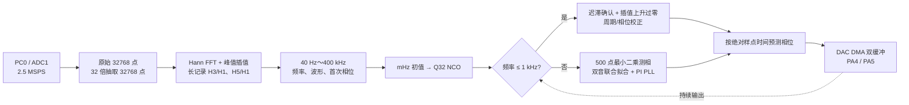

# 锁相思路与代码说明

本文说明 `phase_locking_ported_codex` 中“首次判频 → Q32 NCO → 数字 PLL →
DAC 重建”的完整流程。代码目标是：

- PC0 输入一路干净信号时，PA4 重建同频同类波形并保持固定相位差；
- PC0 输入两路信号的模拟叠加时，PA4、PA5 分别重建低频和高频分量；
- 首次判频不再限制为 5 kHz 整数倍；
- 原 5 kHz 栅格方案完整保留，出现问题时可以一行宏切回；
- 1 kHz 以上沿用已经跑通的 Q32 NCO + PI PLL；40 Hz～1 kHz 只替换病态的
  500 点测相器，改为带迟滞和插值的上升中点过零，Q32 NCO 和 DAC 时间轴不变。

## 1. 一句话概括

先用较长 ADC 记录同时得到频率、波形类型和首次相位，再把结果换成 Q32 相位步进；
高频运行时用短帧最小二乘测相，低频运行时用上升中点过零测相和测周期，DAC 始终
按照绝对样点时间生成未来半缓冲区，因此输入和输出不会持续相对漂移。



## 2. 输入、输出和默认模式

| 项目 | 默认配置 |
|---|---|
| MCU | STM32H743VIT6 |
| 时钟源 | 内部 HSI |
| ADC 输入 | PC0 / ADC1_INP10 |
| DAC1 输出 | PA4 / DAC1_OUT1 |
| DAC2 输出 | PA5 / DAC1_OUT2 |
| ADC/DAC 共同触发 | TIM2 TRGO，2.5 MHz |
| 工作模式 | `SIGSEP_MODE_SINGLE` |
| 判频模式 | `SIGSEP_FREQ_MODE_PRECISE_FFT` |
| 默认判频范围 | 40 Hz～400 kHz |
| 双音最小建议间隔 | 4 kHz |

单通道模式只使用 PA4，PA5 保持约 1.65 V 中点。双通道模式中 PA4 固定输出
较低频分量，PA5 固定输出较高频分量。

## 3. 第一步：高精度首次判频

代码入口：

- `Core/User/frequency_estimator.c`
- `frequency_estimator_push()`
- `prepare_spectrum()`
- `interpolate_peak_millihz()`
- `refine_frequency_phase_millihz()`

### 3.1 为什么不再使用 500 点直接判断任意频率

原方案每帧分析 500 点：

```text
2.5 MHz / 500 = 5 kHz
```

因此在 10～100 kHz 范围搜索 5 kHz 正交频点非常合适，但输入为
20.3 kHz、31.7 kHz 之类的非栅格频率时，能量会泄漏到相邻候选点，首次判断
可能偏到错误频率。

默认高精度模式改为连续收集 32768 点：

```text
观察时间 = 32768 / 2.5 MHz = 13.1072 ms
FFT 频点间隔 = 2.5 MHz / 32768 ≈ 76.2939 Hz
```

### 3.2 实际处理顺序

1. 连续收集 64 个完整 ADC DMA 半区，每半区 512 点。
2. 计算全记录平均值并去除直流偏置。
3. 加 Hann 窗，降低非整数周期截断的谱泄漏。
4. 执行 32768 点基 2 FFT。
5. 在配置频段内寻找最强局部谱峰。
6. 用峰值左右相邻点的对数功率做三点抛物线插值。
7. 分别测量记录前半段和后半段的基波相位。
8. 根据两段相位差除以时间间隔，再细化一次频率。
9. 以 `frequency_millihz` 保存结果，避免重新量化为整数 Hz。

双通道模式寻找第二峰时，会屏蔽第一峰附近 4 kHz 的区域，避免把同一主峰的
谱泄漏重复识别成第二路信号。保护频点数使用向下取整，最终再用插值后的实际
频率复核间隔，因此恰好相差 4 kHz 的双音不会因 FFT bin 量化被提前排除。

FFT 旋转因子、Hann 窗和相位相关振荡器都使用 M7 单精度 FPU 递推。为了避免
32768 点递推产生模长漂移，代码每 256 点归一化一次。

### 3.3 40 Hz 低频记录与 1～4 kHz 波形分类修复

原始 32768 点只有 13.1072 ms，40 Hz 仅覆盖 0.524 周期；所以不能只把搜索
下限宏改成 40。单信号模式在接收原始数据时，同时把每 32 点做一次盒式平均：

```text
低频采样率 = 2.5 MHz / 32 = 78.125 kSPS
低频观察时间 = 32768 / 78.125 kSPS = 419.4304 ms
低频 FFT 间隔 = 78.125 kSPS / 32768 ≈ 2.3842 Hz
```

原始记录搜索 1.2～400 kHz，抽取记录分析 40～1.5 kHz；最终只在抽取结果不高于
1.2 kHz 且基波幅值足够可信时选择低频路径。0.3～1.2 kHz 方波在原始短记录中
可能先出现 3、5、31 次谐波，这个“双路径幅值比较”可避免把谐波当成高频基波。

旧代码虽然用 32768 点判频，最终却仍在最后 500 点上测 H3/H5。1、2、3、4 kHz
分别只有 0.2、0.4、0.6、0.8 周期，纯正弦也会因非正交泄漏产生虚假 H3。
现在 `fill_harmonic_profile()` 在同一段长记录上测量：

```text
正弦：H3/H1 ≈ 0
三角：H3/H1 = 1/9，H5/H1 = 1/25
方波：H3/H1 = 1/3，H5/H1 = 1/5
```

`frequency_estimator_result_t` 同时返回频率、最后一个原始 DMA 块首点相位、
基波幅值、直流中心以及 H3/H1、H5/H1。低频 32 点平均的 15.5 样点群延迟也在
`phase_at_last_raw_block()` 中补偿，因此首次 NCO 相位仍对应原始 ADC 时间轴。

## 4. 第二步：把频率初值送入 Q32 NCO

代码入口：

- `Core/User/signal_separation.c`
- `phase_step_q32_millihz()`
- `nco_init()`

Q32 相位中，`2^32` 表示一个完整周期。频率初值转换为每个采样点的相位步进：

```text
nominal_step =
    frequency_millihz × 2^32 / (sample_rate_hz × 1000)
```

对应代码：

```c
static uint32_t phase_step_q32_millihz(uint32_t frequency_millihz)
{
  return (uint32_t)(((uint64_t)frequency_millihz * 4294967296ULL) /
                    ((uint64_t)SIGSEP_SAMPLE_RATE_HZ * 1000ULL));
}
```

这里直接使用毫赫兹结果，所以高精度判频不会在进入 NCO 时又退化成整数 Hz。
原栅格模式和快速连续模式也使用同一 NCO，只是它们提供的初值精度较低。

## 5. 第三步：每帧重新测量输入相位

代码入口：

- `measure_component_with_step()`
- `measure_components_dual_with_step()`
- `solve_linear_system_4x4()`
- `phase_from_iq()`
- `track_component_independent()`
- `track_components_independent_dual()`
- `track_component_low_frequency()`
- `low_lock_accept_crossing()`

每个 ADC DMA 半区为 512 点，PLL 每 204.8 μs 更新一次：

```text
PLL 更新频率 = 2.5 MHz / 512 ≈ 4.8828 kHz
```

原 5 kHz 栅格模式中，500 点恰好使候选正弦、余弦相互正交，直接相关就能测相。
但 1 kHz 输入在 500 点里只有 0.2 个周期；任意双音也不再满足正交条件。若仍
直接使用原相关公式，直流项和另一分量会泄漏进相位，造成低频相位偏差或双路
PLL 相互拉扯。

现在 1 kHz 以上的单通道每帧拟合：

```text
x[n] = a × sin(ωn) + b × cos(ωn) + dc

amplitude = sqrt(a² + b²)
phase = atan2(b, a)
```

代码通过中心化 2×2 正规方程消去 `dc`。在原 5 kHz 正交频点上，它会自然
退化为原相关结果；1 kHz 的 0.2 周期仍可工作，但到 40 Hz 时只有 0.008 周期，
矩阵接近奇异，不能再靠降低行列式门限硬算。

双通道不是先后做两次独立相关，而是在同一个混合帧联合拟合：

```text
x[n] =
    a0 sin(ω0n) + b0 cos(ω0n)
  + a1 sin(ω1n) + b1 cos(ω1n)
  + dc
```

`measure_components_dual_with_step()` 构造中心化 4×4 Gram 矩阵，
`solve_linear_system_4x4()` 用带部分主元的高斯消元同时求出四个系数。这样
10 kHz + 14 kHz 等非正交双音不会把一个分量的相位泄漏到另一个 PLL。双路
测相完成后，两个 PI/NCO 仍完全独立。若矩阵因异常配置接近奇异，本帧会被
标为无效并冻结 PLL，不会退回已知会产生双音串扰的两次独立拟合。

### 5.1 40 Hz～1 kHz 的上升中点过零锁相

低频单信号使用输入长记录的直流均值作为中心，迟滞半宽初始取基波幅值的 8%：

1. 样点先低于 `center - hysteresis`，检测器才进入 armed 状态；
2. 上升穿过 `center` 时，在相邻 ADC 样点间做线性插值，保存 Q16 过零时刻；
3. 随后必须达到 `center + hysteresis`，本次过零才确认，抑制中心附近噪声抖动；
4. 相邻确认过零的 Q16 时间差给出周期，四分之一 IIR 平滑后换算 NCO 步进；
5. 正弦、三角、方波的上升中点统一定义为相位 0，用该时刻校正 Q32 NCO 相位；
6. 每个完整周期的最大/最小 ADC 值继续缓慢更新中心、迟滞和 DAC 幅值；
7. 约 2.5 个预计周期没有确认过零，自动调用 `signal_separation_restart_identify()`。

频率步进更新前，代码先用旧步进把 NCO 相位重基准到本次过零，再改变
`step_correction`，避免把新频率错误地追溯应用到过去整个周期而产生相跳。

## 6. 第四步：PI 型数字 PLL

核心函数：

```c
static int32_t nco_update_lock(uint32_t channel,
                               uint32_t measured_phase,
                               uint64_t frame_start_sample);
```

处理顺序如下：

1. `nco_phase_at_sample()` 根据绝对采样点编号预测当前 NCO 相位。
2. 32 位无符号相减后转成 `int32_t`，自然得到 `-180°～+180°` 的环形相位误差。
3. 相位误差的一部分直接修正参考相位。
4. PI 支路把相位误差换成 NCO 步进修正，用来消除持续频差。
5. 积分器带轻微泄漏并显式限幅，防止长期饱和后难以恢复。
6. 最终步进修正限制在名义步进的约 ±2%。

简化后的核心关系为：

```text
phase_error = measured_phase - predicted_phase

integrator =
    leak × integrator + phase_error

step_correction =
    phase_error / (512 × Kp_div)
  + integrator  / (512 × Ki_div)

actual_step = nominal_step + clamp(step_correction)

phase_reference =
    predicted_phase + phase_error / 2
```

下面是锁相代码的等价核心；为突出主线，用 `clamp()` 代替了源码中的显式
`if` 限幅。可直接编译的完整实现见 `Core/User/signal_separation.c` 的
`nco_update_lock()`：

```c
uint32_t predicted_phase =
  nco_phase_at_sample(channel, frame_start_sample);
int32_t phase_error = (int32_t)(measured_phase - predicted_phase);

integrator =
  ((integrator * SIGSEP_PLL_INTEGRATOR_LEAK_NUM) / 65536LL) +
  phase_error;
integrator = clamp(integrator, -integrator_limit, integrator_limit);

correction =
  phase_error / (512 * SIGSEP_PLL_STEP_KP_DIV) +
  integrator  / (512 * SIGSEP_PLL_STEP_KI_DIV);
correction = clamp(correction, -max_correction, max_correction);

nco_state[channel].step_correction = correction;
nco_state[channel].phase_reference =
  predicted_phase +
  phase_error / (1U << SIGSEP_PLL_PHASE_KP_SHIFT);
nco_state[channel].sample_reference = frame_start_sample;
```

对应超参数位于 `Core/User/signal_separation_config.h`：

```c
#define SIGSEP_PLL_PHASE_KP_SHIFT       1U
#define SIGSEP_PLL_STEP_KP_DIV          20U
#define SIGSEP_PLL_STEP_KI_DIV          200U
#define SIGSEP_PLL_MAX_CORR_DIV         50U
#define SIGSEP_PLL_INTEGRATOR_LIMIT     1099511627776LL
#define SIGSEP_PLL_INTEGRATOR_LEAK_NUM  65535U
```

当前代码没有因为判频升级而修改这些已经跑通的 PLL 参数。高精度判频只负责让
PLL 从更接近真实频率的位置开始，减少捕获时间和误锁概率。

## 7. 第五步：按照绝对时间生成 DAC

代码入口：

- `nco_phase_at_sample()`
- `service_dac_halves()`
- `fill_dac_half_signal()`
- `build_dac_samples()`

ADC 和两路 DAC 都由同一个 TIM2 TRGO 触发，所以它们共享 2.5 MHz 样点时间。
DMA 回调只递增事件计数，主循环使用事件计数恢复绝对样点编号。

当一个 DAC 半区释放时，程序计算该半区下一次真正播放时的 `play_sample`，再用：

```text
phase(play_sample) =
    phase_reference + actual_step ×
    (play_sample - sample_reference)
```

生成整段未来 DAC 数据。即使主循环偶尔跳过一个 ADC 半帧，NCO 仍沿绝对样点
时间推进，不会因为软件处理延迟永久丢失相位时间轴。

## 8. 单通道与双通道锁相

### 8.1 单通道

```c
#define SIGSEP_OPERATION_MODE SIGSEP_MODE_SINGLE
```

- 只识别一个最强基波；
- 只初始化通道 0 NCO；
- `track_component_independent(0, ...)` 用 2×2 最小二乘持续测相和更新 PLL；
- PA4 输出重建波形；
- PA5 始终输出中点。

### 8.2 双通道

```c
#define SIGSEP_OPERATION_MODE SIGSEP_MODE_DUAL_MIXED
#define SIGSEP_COMMON_SOURCE_LOCK 0U
```

- 识别两个主峰并按低频到高频排序；
- 两个通道分别保存频率、相位、幅值、波形类型和 NCO 状态；
- `track_components_independent_dual()` 先联合测量两路相位，再分别更新两个 PLL；
- PA4 锁低频分量，PA5 锁高频分量；
- 适用于两路独立信号源或未知是否共用时钟的情况。

`SIGSEP_COMMON_SOURCE_LOCK=1U` 是参考工程的同源主从扩展。只有确认两分量来自
同一个相干时钟时才使用；默认保持 `0U`，避免独立信号源下第二路不能自行纠偏。
该模式按主通道幅度门控：主通道失效时两路一起冻结；只要主通道有效，从通道
会按频率比继续跟随，即使从通道本身暂时低于幅度阈值。

## 9. 三种首次判频模式

| 宏 | 说明 | 适用场景 |
|---|---|---|
| `SIGSEP_FREQ_MODE_GRID_5KHZ` | 原 10～100 kHz、5 kHz 栅格方案 | 回退、复现原题基线 |
| `SIGSEP_FREQ_MODE_CONTINUOUS` | 4096 点、250 Hz 细搜索 | RAM 或启动时间受限 |
| `SIGSEP_FREQ_MODE_PRECISE_FFT` | 32768 点 FFT、插值、相位斜率 | 默认，优先首次判频精度 |

切换位置：

```c
#define SIGSEP_FREQUENCY_MODE SIGSEP_FREQ_MODE_PRECISE_FFT
```

切换后必须 Clean、Build 并重新下载；仅按复位键不会改变编译期模式。

## 10. 主要代码索引

| 文件/函数 | 作用 |
|---|---|
| `signal_separation_config.h` | 工作模式、判频范围、PLL 参数 |
| `frequency_estimator_push()` | 连续收集长记录并输出高精度频率 |
| `prepare_spectrum()` | 去直流、Hann 窗、FFT |
| `find_strongest_peak()` | 单/双主峰搜索 |
| `refine_frequency_phase_millihz()` | 前后半段相位斜率细化 |
| `fill_harmonic_profile()` | 长记录基波幅相和 H3/H1、H5/H1 |
| `phase_at_last_raw_block()` | 抽取群延迟补偿并映射到原始 ADC 时间轴 |
| `analyze_frame()` | 在三种判频模式之间分发 |
| `nco_init()` | 用首次频率和相位初始化 NCO |
| `measure_component_with_step()` | 单信号带直流项 2×2 最小二乘测幅、测相 |
| `measure_components_dual_with_step()` | 双信号 4×4 联合最小二乘测幅、测相 |
| `solve_linear_system_4x4()` | 带部分主元的双音正规方程求解 |
| `nco_update_lock()` | PI PLL、积分泄漏和限幅 |
| `update_tracked_component()` | 有效幅度门控、PLL 更新和幅度平滑 |
| `track_component_independent()` | 单通道闭环更新 |
| `track_component_low_frequency()` | 40 Hz～1 kHz 迟滞/插值上升过零检测 |
| `low_lock_accept_crossing()` | 低频周期平滑、NCO 步进和相位校正 |
| `track_components_independent_dual()` | 双通道联合测相、独立闭环更新 |
| `service_dac_halves()` | DAC 事件时间轴与安全半区选择 |
| `fill_dac_half_signal()` | 按未来播放时刻生成 PA4/PA5 数据 |
| `signal_separation_restart_identify()` | 丢弃旧结果并重新判频 |

## 11. 调试时重点观察

进入 Debug 后建议添加：

```text
separation_identified
active_component[0].frequency_millihz
active_component[1].frequency_millihz
nco_state[0].nominal_step
nco_state[0].step_correction
nco_state[0].last_error
nco_state[0].integrator
low_lock_state.center_adc
low_lock_state.hysteresis_adc
low_lock_state.filtered_period_q16
adc_frame_overrun
dac_half_overrun
```

正常现象：

- 首次识别完成后 `separation_identified=1`；
- `step_correction` 不应长期顶在正、负限幅；
- `last_error` 可以有噪声，但不应持续单方向增长；
- 输入幅度低于 `SIGSEP_MIN_VALID_ADC_AMP` 时，PLL 会冻结而不是积分噪声相位；
- 示波器上输入和对应 DAC 输出的相位差可以是固定常量，但不应持续漂移。

改变输入频率后，发送串口字符 `r`/`R`，或者调用：

```c
signal_separation_restart_identify();
```

重新执行首次判频。

## 12. 物理限制和实板验证

- 2.5 MSPS 的理论奈奎斯特上限为 1.25 MHz，不存在不受采样率和模拟带宽限制的
  “无限任意频率”。
- 单信号软件范围为 40 Hz～400 kHz。三类波形分类要求 H3 低于奈奎斯特，
  因而理论统一上限约为 416.7 kHz；400 kHz 时 DAC 仅有 6.25 点/周期，实际
  模拟带宽、H3 衰减和阶梯失真必须上板验证。
- 40 Hz～1.2 kHz 首次识别使用约 419 ms 抽取记录；低频实时锁相只覆盖到
  `SIGSEP_LOW_LOCK_MAX_HZ=1000`，1～1.2 kHz 仍可用长记录判频/分类并走原 PLL。
- `frequency_millihz` 是数值分辨率，不等于实板绝对精度。内部 HSI 的频差、
  温漂、ADC 时钟误差、前端噪声和波形失真都会进入实际误差。
- 双音相距小于 4 kHz、幅度差过大或输入削顶时，第二峰仍可能误判，需要更长
  记录或专门的双音参数估计算法。
- 对单路 ADC 的频谱而言，“强三角波/方波的三次谐波”和“恰好位于该频率的
  第二路真实基波”在数学上可能是同一条谱线。若强分量谐波高于弱分量基波，
  仅靠这一路混合采样无法无条件判定它的来源；测试时应控制两路幅度，必要时
  增加题目先验、独立输入或更复杂的多谐波模型。
- 当前软件逻辑和编译可以在无开发板条件下验证；最终“锁住且不漂移”必须上板
  用示波器同时观察 PC0 与 PA4/PA5。

建议实板依次测试：

1. 单正弦：10.3 kHz、17.8 kHz、51.7 kHz、99.6 kHz。
2. 单三角/方波：确认波形分类和 PA4 重建。
3. 双正弦：20.3 kHz + 31.7 kHz，确认 PA4/PA5 排序。
4. 双信号不同幅度：确认弱分量仍能被识别。
5. 每组连续观察 30 秒，确认相位差不持续单方向漂移。
