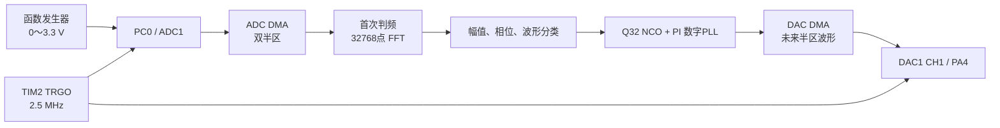
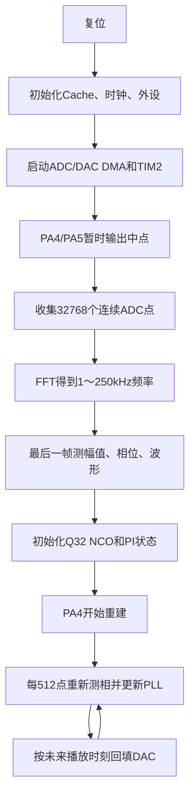

# 从零完成 STM32H743 单信号识别、重建与锁相

这份文档不是只告诉你“改哪个参数”，而是帮助你自己从零搭出整个项目，并能读懂、修改和调试锁相代码。
最终目标是：

- PC0 输入一路带 1.65 V 直流偏置的正弦波、三角波或方波；
- STM32H743VIT6 判断输入频率和波形类型；
- PA4 用 DAC 重建同频、同类并与输入保持固定相位差的波形；
- PA5 在默认单信号模式下保持约 1.65 V；
- 输入频率改变后，通过复位或串口发送 `r` 重新识别；
- 当前最终版的软件搜索范围是 1 kHz～250 kHz。

> 注意：本教程描述的是当前最终版，不包含后来试验但已撤销的 40 Hz 长记录方案。

## 1. 先认识常见英文和专业名词

| 名称 | 英文全称 | 简单解释 |
|---|---|---|
| ADC | Analog-to-Digital Converter | 模数转换器，把 PC0 电压变成数字 |
| DAC | Digital-to-Analog Converter | 数模转换器，把数字重新变成 PA4 电压 |
| DMA | Direct Memory Access | 直接存储器访问，外设不用 CPU 逐点搬数据 |
| FFT | Fast Fourier Transform | 快速傅里叶变换，把时域波形转换成频谱 |
| PLL | Phase-Locked Loop | 锁相环，让本地产生波形的相位追随输入 |
| DPLL | Digital Phase-Locked Loop | 数字锁相环；本工程的 PLL 全部由软件计算 |
| NCO | Numerically Controlled Oscillator | 数控振荡器，用数字相位累加产生周期波形 |
| PI | Proportional-Integral | 比例积分控制；P 负责快速纠偏，I 消除长期频差 |
| I/Q | In-phase / Quadrature | 同相/正交分量，也可理解为正弦和余弦两个方向 |
| LUT | Look-Up Table | 查找表；这里提前保存一周期正弦值 |
| TRGO | Timer Trigger Output | 定时器触发输出，让 ADC 和 DAC 同时迈一步 |
| ISR | Interrupt Service Routine | 中断服务程序；本工程中只记录事件，不做算法 |
| IRQ | Interrupt Request | 中断请求 |
| Cache | CPU Cache | CPU 缓存；速度快，但需要处理与 DMA 的一致性 |
| D-Cache | Data Cache | 数据缓存 |
| I-Cache | Instruction Cache | 指令缓存 |
| MSPS | Million Samples Per Second | 每秒百万次采样；2.5 MSPS 就是每秒250万点 |
| mHz | millihertz | 毫赫兹，0.001 Hz；注意不是 MHz（兆赫兹） |
| Nyquist | Nyquist limit | 奈奎斯特上限，理论上最高可辨频率小于采样率一半 |
| Q32 | 32-bit phase format | 用0～`2^32-1`表示0～一整周期的相位 |
| least squares | Least Squares | 最小二乘，用一组采样点拟合最符合的波形参数 |
| Hann window | Hann Window | 汉宁窗，减轻截断一段波形造成的频谱泄漏 |

这里常说“锁上了”，不是说输入输出一定完全重合，而是说二者的相位差成为一个稳定常量，不再持续向前或向后漂移。

## 2. 系统整体结构



为什么 ADC 和 DAC 必须由同一个 TIM2 触发？因为锁相计算需要一把共同的“时间尺”。如果 ADC 用一个定时器、DAC 用另一个定时器，两边的时钟即使名义频率相同，也会因为微小误差逐渐错开。

## 3. 硬件连接与安全

| 功能 | 引脚 | 连接 |
|---|---|---|
| 信号输入 | PC0 / ADC1_INP10 | 函数发生器输出 |
| 锁相输出 | PA4 / DAC1_OUT1 | 示波器输出通道 |
| 默认中点 | PA5 / DAC1_OUT2 | 默认约1.65 V |
| 串口发送 | PB14 / USART1_TX | USB转串口 RX |
| 串口接收 | PB15 / USART1_RX | USB转串口 TX |
| 调试 | PA13/PA14 | SWDIO/SWCLK |

PC0 没有外部运放缓冲、自动偏置和限幅保护，必须做到：

1. 函数发生器、开发板和示波器共地；
2. 函数发生器建议设置为 High-Z；
3. 输入最低电压不低于0 V，最高不超过3.3 V；
4. 交流波形设置约1.65 V DC Offset；
5. 先从0.5～1.0 Vpp开始；
6. 不要把负电压直接接入PC0。

## 4. 在 STM32CubeIDE 创建工程

1. 打开 STM32CubeIDE 1.19.0。
2. 选择 **File → New → STM32 Project**。
3. 在 **MCU/MPU Selector** 搜索 `STM32H743VIT6`。
4. 选择该芯片并点击 **Next**。
5. 输入工程名，例如 `phase_locking_ported_codex`。
6. Targeted Language 选择 **C**。
7. Targeted Binary Type 选择 **Executable**。
8. Targeted Project Type 选择 **Empty** 或默认 STM32Cube 工程。
9. 完成后打开工程的 `.ioc` 文件。

后续所有 CubeMX 自动生成函数，例如 `MX_ADC1_Init()`，不要手工改函数内部；应当在 `.ioc` 中修改并重新生成。

## 5. 配置时钟

本工程只使用内部 HSI（High-Speed Internal oscillator，内部高速振荡器）。

### 5.1 CORTEX_M7

打开：

`Pinout & Configuration → System Core → CORTEX_M7`

设置：

- CPU I-Cache：Enabled
- CPU D-Cache：Enabled

### 5.2 Clock Configuration

当前工程的关键结果：

- HSI：64 MHz
- CPU Clock：480 MHz
- HCLK：240 MHz
- APB1 Timer Clock：240 MHz
- PLL2P：78.4 MHz
- ADC 界面显示时钟：78.4 MHz

STM32H743 Rev.V 的 ADC 内核还会再除以2，因此实际 ADC 内核约39.2 MHz。不要因为看到其他工程使用49 MHz，就擅自把这里改回去。

### 5.3 TIM2

打开：

`Timers → TIM2`

设置：

- Clock Source：Internal Clock
- Prescaler：0
- Counter Period：95
- Auto-reload preload：Enable
- Trigger Event Selection / Master Output Trigger：Update Event

定时器更新频率：

```text
Fs = 240 MHz / (PSC + 1) / (ARR + 1)
   = 240 MHz / 1 / 96
   = 2.5 MHz
```

`Fs` 是 Sampling Frequency，采样频率。

## 6. 配置 ADC、DAC、DMA 和串口

### 6.1 ADC1

PC0 设置为 `ADC1_INP10`，ADC1关键参数：

- Resolution：16 bit
- Number of Conversion：1
- External Trigger：TIM2 TRGO
- Trigger Edge：Rising Edge
- Conversion Data Management：DMA Circular
- Overrun：Data Overwritten
- Sampling Time：1.5 cycles

ADC1 DMA：

- DMA1 Stream0
- Direction：Peripheral to Memory
- Mode：Circular
- Peripheral Increment：Disable
- Memory Increment：Enable
- Peripheral/Memory Data Width：Half Word
- Priority：High

### 6.2 DAC1

- PA4：DAC1_OUT1
- PA5：DAC1_OUT2
- 两路 Trigger 都选择 TIM2 TRGO
- Output Buffer：Enable

DAC CH1 DMA：

- DMA1 Stream1
- Memory to Peripheral
- Circular
- Half Word
- Priority Very High

DAC CH2 DMA同理，使用 DMA1 Stream2。

### 6.3 DMA 中断优先级

- ADC DMA：5
- DAC CH1 DMA：6
- DAC CH2 DMA：7
- USART1：8

数值越小，Cortex-M中断优先级越高。这样高速采样和输出优先于串口打印。

### 6.4 USART1

- PB14：USART1_TX
- PB15：USART1_RX
- Asynchronous
- 115200 bit/s
- 8 data bits、No parity、1 stop bit，也就是常说的8N1

## 7. 用户代码应如何组织

```text
Core/User/
├─ system.h
├─ system.c
├─ signal_separation_config.h
├─ signal_separation.h
├─ signal_separation.c
├─ frequency_estimator.h
├─ frequency_estimator.c
├─ uart_debug.h
└─ uart_debug.c
```

`main.c`只保留两处用户调用：

```c
/* USER CODE BEGIN 2 */
system_init();
/* USER CODE END 2 */

while (1)
{
  /* USER CODE BEGIN 3 */
  system_process();
  /* USER CODE END 3 */
}
```

`system_init()`先初始化串口信息，再启动信号链；`system_process()`不断处理DMA事件和串口命令。

## 8. 第一步实现：同步 ADC/DAC DMA

DMA缓冲区必须放在DMA1可访问的D2 SRAM，并按32字节对齐：

```c
static uint16_t adc_dma_buffer[SIGSEP_ADC_DMA_LEN]
  __attribute__((section(".dma_buffer"), aligned(32)));
static uint16_t dac1_dma_buffer[SIGSEP_DAC_DMA_LEN]
  __attribute__((section(".dma_buffer"), aligned(32)));
static uint16_t dac2_dma_buffer[SIGSEP_DAC_DMA_LEN]
  __attribute__((section(".dma_buffer"), aligned(32)));
```

链接脚本中把 `.dma_buffer` 放到 `RAM_D2`。H743开启D-Cache后：

- DMA写ADC、CPU读之前：Invalidate（失效）Cache；
- CPU写DAC、DMA读之前：Clean（清理）Cache。

如果忽略这一步，调试窗口看到的数组可能和DMA真实数据不一致，波形会重复、断裂或完全不更新。

中断回调只增加计数：

```c
void HAL_ADC_ConvHalfCpltCallback(ADC_HandleTypeDef *hadc)
{
  if (hadc->Instance == ADC1)
  {
    adc_dma_event_flag++;
  }
}
```

不要在中断里做FFT、串口打印或循环生成DAC波形。真正算法全部放在主循环。

启动顺序：

1. 核验TIM2确实为2.5 MHz；
2. 生成正弦查找表；
3. DAC两个半区先填2048中点；
4. 校准ADC；
5. 启动DAC CH1/CH2 DMA；
6. 启动ADC DMA；
7. 最后启动TIM2。

最后启动TIM2，可以避免某个外设提前走了几个采样点。

## 9. 第二步实现：首次判断频率

锁相环不是万能搜索器。必须先给它一个接近真实频率的初值，再让它持续微调。

默认 `SIGSEP_FREQ_MODE_PRECISE_FFT` 收集32768点：

```text
采集时间 = 32768 / 2.5 MHz ≈ 13.1072 ms
FFT频点间隔 = 2.5 MHz / 32768 ≈ 76.2939 Hz
```

具体顺序：

1. 连续拼接64个512点DMA半区；
2. 计算并减去平均值，去掉1.65 V直流偏置；
3. 乘Hann窗，减少频谱泄漏；
4. 执行32768点基2 FFT；
5. 在1～250 kHz内找最强局部峰；
6. 用峰值左右三个频点做对数抛物线插值；
7. 比较长记录前后两半的相位差，再细化频率；
8. 用 `frequency_millihz` 保存结果。

注意 `mHz` 是毫赫兹。例如：

```text
1234567 mHz = 1234.567 Hz
```

首次FFT只输出频率。当前最终版的初始幅值、初始相位和波形分类，是在FFT结束时用最新512点DMA块的前500点重新测量得到的。

## 10. 第三步实现：判断正弦、三角和方波

理想波形的奇次谐波特点：

- 正弦波：基本只有基波；
- 方波：三次谐波约为基波的1/3；
- 三角波：三次谐波约为基波的1/9。

代码测量基波、三次谐波和五次谐波幅度：

```text
H3/H1 > 0.22  → 方波
H3/H1 > 0.06  → 三角波
其余          → 正弦波
```

`H1`表示基波，`H3`表示三次谐波，`H5`表示五次谐波。

当前实现只用前500点分类。1 kHz在500点中只有0.2个周期，所以1～4 kHz分类对噪声、偏置和起始相位比较敏感。这是当前最终版保留的已知限制；锁相正常不等于波形分类一定正确。

## 11. 第四步实现：测量输入相位

已知频率后，把输入拟合成：

```text
x[n] = a·sin(ωn) + b·cos(ωn) + dc
```

- `dc` 是直流偏置；
- `a`、`b` 是同相/正交系数；
- 幅值约为 `sqrt(a²+b²)`；
- 相位由 `atan2(b,a)` 得到。

代码不是简单把输入乘正弦再求和，而是建立中心化2×2最小二乘方程。这样即使500点不是整数个周期，直流偏置也不容易串入相位。

对应函数：

- `measure_component_with_step()`：单信号幅值和相位；
- `phase_from_iq()`：把I/Q系数变成Q32相位；
- `track_component_independent()`：每个DMA半区重新测量。

## 12. 第五步实现：Q32 NCO

NCO是本地产生输出波形的数字时钟。

Q32规定：

```text
0            = 0°
2^30         = 90°
2^31         = 180°
3 × 2^30     = 270°
2^32后溢出   = 回到0°
```

每采样点相位增加：

```text
nominal_step = frequency × 2^32 / sample_rate
```

本工程保留到毫赫兹：

```c
step = frequency_millihz * 2^32 /
       (SIGSEP_SAMPLE_RATE_HZ * 1000);
```

使用无符号32位自然溢出，就能自动完成一周期回绕，不需要每次判断是否超过360°。

NCO状态包含：

- `nominal_step`：首次判频得到的理想步进；
- `step_correction`：PLL给出的频率微调；
- `phase_reference`：某个参考采样点的相位；
- `sample_reference`：该参考采样点的绝对编号；
- `integrator`：PI控制器积分项；
- `last_error`：最近一次相位误差。

## 13. 第六步实现：数字锁相环

### 13.1 为什么只按初始频率输出会漂移

假设输入真实频率为20000.2 Hz，本地NCO为20000.0 Hz。每秒会少走0.2个周期，输入输出相位差就会一直变化。只做一次FFT不叫持续锁相。

### 13.2 每一帧做什么

每512个ADC点更新一次：

```text
更新频率 = 2.5 MHz / 512 ≈ 4882.8次/秒
```

流程：

1. 用绝对采样点编号预测当前NCO相位；
2. 最小二乘测得输入相位；
3. `phase_error = measured - predicted`；
4. P支路快速修正相位和少量频率；
5. I支路累计长期偏差，消除持续频差；
6. 限制修正范围，防止噪声导致失控；
7. 保存新的相位参考点。

### 13.3 为什么相位误差能自动落在±180°

Q32相位使用 `uint32_t`。两个相位相减后转成 `int32_t`：

```c
int32_t phase_error =
  (int32_t)(measured_phase - predicted_phase);
```

32位溢出会自动选择环形相位中的最短方向。例如359°到1°的误差会被理解为+2°，不是-358°。

### 13.4 PI代码如何理解

核心关系：

```text
integrator = leak × integrator + phase_error

step_correction =
    phase_error / (512 × Kp_div)
  + integrator  / (512 × Ki_div)

actual_step = nominal_step + step_correction
```

当前参数：

```c
#define SIGSEP_PLL_PHASE_KP_SHIFT       1U
#define SIGSEP_PLL_STEP_KP_DIV          20U
#define SIGSEP_PLL_STEP_KI_DIV          200U
#define SIGSEP_PLL_MAX_CORR_DIV         50U
#define SIGSEP_PLL_INTEGRATOR_LEAK_NUM  65535U
```

解释：

- `PHASE_KP_SHIFT=1`：每次直接修正约一半相位误差；
- `STEP_KP_DIV=20`：相位误差对频率修正的即时作用；
- `STEP_KI_DIV=200`：积分项作用较慢，用来消除长期频差；
- `MAX_CORR_DIV=50`：最大频率修正约为名义值的±2%；
- `LEAK_NUM=65535`：积分器每次轻微衰减，防止旧误差永久积累。

源代码入口：

```c
static int32_t nco_update_lock(uint32_t channel,
                               uint32_t measured_phase,
                               uint64_t frame_start_sample);
```

阅读时按以下顺序找变量：

1. `predicted_phase`：NCO认为输入现在应在什么相位；
2. `phase_error`：实测与预测相差多少；
3. `integrator`：累计的长期误差；
4. `correction`：准备加到NCO步进上的修正；
5. `phase_reference`：把相位参考拉近实测值；
6. `sample_reference`：记录这次修正发生在哪个绝对样点。

### 13.5 为什么输出不会因为软件延迟不断漂移

程序不按“CPU现在运行到哪里”生成DAC，而是按“这个DAC半区未来真正播放时的绝对采样点”计算相位：

```text
phase(play_sample) =
    phase_reference
  + actual_step × (play_sample - sample_reference)
```

ADC、DAC共用TIM2，所以绝对采样点就是统一时间轴。CPU晚几十微秒填充缓冲区，只要没有错过安全半区，生成的仍然是未来正确时刻的相位。

## 14. 第七步实现：DAC波形重建

`build_dac_samples()`根据波形类型生成：

- 正弦波：从 `sine_lut[]` 查表；
- 方波：相位前半周期输出高电平，后半周期输出低电平；
- 三角波：根据Q32相位分段线性变化。

输出中心为：

```c
#define SIGSEP_DAC_MID 2048U
```

12位DAC范围0～4095，因此2048约为1.65 V。

单信号模式：

- PA4使用通道0 NCO重建；
- PA5每个DMA半区始终填2048；
- PA5没有交流波形是正常现象。

## 15. 程序完整运行顺序



32768点采集理论上约13.1 ms，但还需要FFT运算时间。识别完成前PA4保持中点，不能承诺复位后固定多少毫秒一定出现波形。

## 16. 串口和调试

启动时应看到：

```text
mode=single, signal=PA4, PA5=midscale
frequency=precise_fft, N=32768, Hann+peak+phase
state=search
```

成功后只打印一次：

```text
locked A=20000.000Hz/sin adc_drop=0 dac_drop=0
```

输入频率改变后，程序不会自动重新搜索。必须：

- 按RESET；或
- USART1发送 `r`/`R`；或
- 调用 `signal_separation_restart_identify()`。

Debug建议观察：

```text
separation_identified
active_component[0].frequency_millihz
active_component[0].wave
active_component[0].amplitude_adc
nco_state[0].nominal_step
nco_state[0].step_correction
nco_state[0].last_error
nco_state[0].integrator
adc_frame_overrun
dac_half_overrun
```

不要长时间停在断点上判断实时系统是否正常。CPU停止时，定时器和DMA可能继续运行，恢复后产生的drop计数是调试暂停造成的。

## 17. 没有输出时如何逐层排查

1. 确认下载的是当前工程的 `Debug/phase_locking_ported_codex.elf`。
2. 确认BOOT0为正常Flash启动状态，然后按RESET。
3. 看串口是否出现启动信息；没有则先查程序是否真正运行。
4. 看 `TIM2->ARR` 是否为95、`TIM2->PSC` 是否为0。
5. 看 `adc_dma_event_flag` 是否持续增加。
6. 看 `dac1_dma_event_flag` 是否持续增加。
7. 看 `separation_identified`：
   - 一直为0：检查PC0输入范围、幅度、频率和ADC数组；
   - 已为1：检查DAC DMA、PA4引脚和示波器。
8. 看 `active_component[0].frequency_millihz` 是否接近输入。
9. 检查 `adc_frame_overrun`、`dac_half_overrun` 是否快速增长。
10. 若刚修改过 `.ioc`，确认I-Cache、D-Cache仍为Enabled，DMA Stream和触发源没有被CubeMX改回。

## 18. 如何调PLL参数

先不要同时乱改所有参数，每次只改一个：

| 现象 | 优先调整 | 方向 |
|---|---|---|
| 锁得太慢 | `SIGSEP_PLL_PHASE_KP_SHIFT` | 减小会增强相位直接修正 |
| 相位来回抖动 | `SIGSEP_PLL_PHASE_KP_SHIFT` | 增大以减弱相位修正 |
| 长期缓慢漂移 | `SIGSEP_PLL_STEP_KI_DIV` | 适当减小，增强积分 |
| 频率修正抖动 | `SIGSEP_PLL_STEP_KP_DIV` | 增大，减弱即时频率修正 |
| 频差超过捕获范围 | `SIGSEP_PLL_MAX_CORR_DIV` | 减小会扩大范围，但更易误锁 |
| 拔掉输入后状态乱跑 | 幅度门限 | 提高 `SIGSEP_MIN_VALID_ADC_AMP` |

每次调参都要记录：输入频率、波形、幅度、稳态相位摆动、锁定时间、`step_correction`和drop计数。

## 19. 最终实板验收

1. 默认宏保持 `SIGSEP_MODE_SINGLE` 和 `SIGSEP_FREQ_MODE_PRECISE_FFT`。
2. PC0输入20 kHz正弦波，确认PA4输出、PA5中点。
3. 示波器同时观察PC0和PA4至少30秒，确认相位差不持续漂移。
4. 测试10.3 kHz、17.8 kHz、51.7 kHz、99.6 kHz等非5 kHz整数频率。
5. 测试三角波和方波，并核对串口波形名称。
6. 测试1 kHz、2 kHz、3 kHz、4 kHz时，分别记录频率识别和波形分类；低频分类错误属于当前短帧分类限制。
7. 测试接近250 kHz时，观察DAC阶梯和模拟带宽，不只看软件频率数字。
8. 每次改变输入频率后复位或发送 `r`。
9. 正常全速运行时确认 `adc_drop=0`、`dac_drop=0`。

## 20. 当前最终版的边界

- 默认单信号输入、PA4单通道锁相输出；
- 搜索范围1 kHz～250 kHz；
- 频率数值保存到0.001 Hz不代表实板绝对精度达到0.001 Hz；
- HSI的误差和温漂会影响绝对频率；
- 1～4 kHz波形分类因为500点观察窗口过短而较脆弱；
- 250 kHz时只有约10个DAC点/周期，方波和三角波必然有阶梯；
- 输入改变后需要主动重新识别；
- 最终“锁相不漂移”必须用实板示波器确认，编译成功不能代替硬件验证。

## 21. 你自己重新实现时的检查表

- [ ] ADC和DAC使用同一个TIM2 TRGO
- [ ] TIM2实际触发频率为2.5 MHz
- [ ] ADC DMA和两路DAC DMA都是Circular
- [ ] I-Cache、D-Cache已开启
- [ ] DMA缓冲区在D2 SRAM并按32字节对齐
- [ ] ADC读取前Invalidate，DAC发送前Clean
- [ ] ISR只记录事件
- [ ] 首次判频和实时PLL分为两个阶段
- [ ] 初始频率转换为Q32步进时没有重新取整
- [ ] 每帧测量输入相位
- [ ] PI同时修正相位参考和NCO步进
- [ ] 积分器有泄漏和限幅
- [ ] DAC按未来播放样点生成
- [ ] 输入低于幅度门限时冻结PLL
- [ ] PA5在单信号模式保持中点
- [ ] 改频率后重新识别
- [ ] 串口和示波器都完成验证

真正掌握本项目的标志，不是记住某个宏，而是能够自己解释这条闭环：

```text
输入相位测量
→ 与NCO预测相位比较
→ PI把相位误差变成相位/频率修正
→ NCO按修正后的步进生成未来DAC相位
→ 下一帧再次测量并纠偏
```
